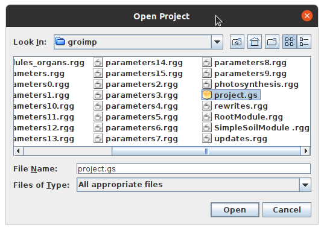
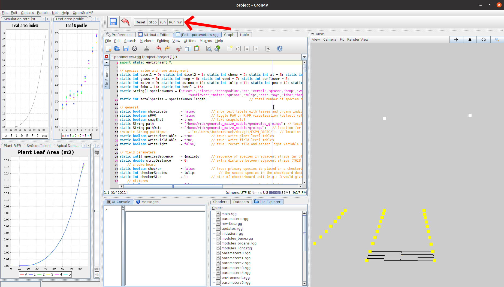

# Generate plant models
This repository contains code to proceduraly create Gazebo models of different plants using GroIMP and Meshlab. We provide a [repository](https://github.com/fieldrobotevent/virtual_maize_field_models) with generated maize and weed models for you to use. However, feel free to generate and test your own plant models.

## Installation
Requires Python >= 3.7, [GroIMP 1.6](http://ufgb966.forst.uni-goettingen.de/GroIMP/) and Java 8.
```commandline
pip install -r requirements.txt
```

If you are working on Linux, [downgrade](https://askubuntu.com/questions/1133216/downgrading-java-11-to-java-8) to Java 8. 

## Create plant models using GroIMP
1. Create GroIMP task:
```commandline
python3 generate_groimp_task.py
```

<details>
  <summary>Click here for the full list of options</summary>
  
  ```
  usage: generate_groimp_task.py [-h] [--groimp_path GROIMP_PATH] [--groimp_output_path GROIMP_OUTPUT_PATH]
                              [--crop_type {dicot1,dicot2,cheno,at,cereal,grass,hemp,weed,sunflower,maize,quinoa,tulip,pea,soy,faba,basil}]

  optional arguments:
  -h, --help            show this help message and exit
  --groimp_path GROIMP_PATH
                          GroIMP folder path.
  --groimp_output_path GROIMP_OUTPUT_PATH
                          GroIMP output path.
  --crop_type {dicot1,dicot2,cheno,at,cereal,grass,hemp,weed,sunflower,maize,quinoa,tulip,pea,soy,faba,basil}
                          Crop type to generate task.
  ```
</details>

2. Open project in GroIMP: `File > Open... >` and select `project.gs` in the `groimp` directory of this repository.



3. Run the simulation by clicking on the `Run run` button. This can take a while.



4. Convert the GroIMP models to Gazebo models:
```commandline
python3 groimp_to_gazebo_models <run number> <run number> <etc.>
```
Replace `<run_number>` by the repetition number you want to use. 

<details>
  <summary>Click here for the full list of options</summary>

  ```
  usage: groimp_to_gazebo_models.py [-h] [--groimp_output_folder GROIMP_OUTPUT_FOLDER] [--model_output_folder MODEL_OUTPUT_FOLDER]
                                  [--min_days MIN_DAYS] [--max_days MAX_DAYS] [--increment INCREMENT]
                                  plant_numbers [plant_numbers ...]

  positional arguments:
  plant_numbers         List of plant numbers

  optional arguments:
  -h, --help            show this help message and exit
  --groimp_output_folder GROIMP_OUTPUT_FOLDER
                          groimp output path with .obj files
  --model_output_folder MODEL_OUTPUT_FOLDER
                          Output path for Gazebo models
  --min_days MIN_DAYS   Minimum day number
  --max_days MAX_DAYS   Maximum day number
  --increment INCREMENT
                          Increment in day numbers
  ```
</details>

5. Copy Gazebo models from `generated` folder to the `models` folder of the [`virtual_maize_field`](https://github.com/fieldrobotevent/virtual_maize_field).

## Copyright
GrowIMP models in folder `growimp` are licenced under CC BY-SA 4.0. Rest of repository is licenced as GPLv3.
